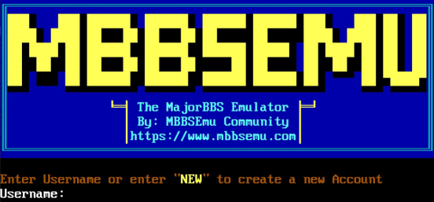

# The MajorBBS Emulation Project 

[Home](https://www.mbbsemu.com) | [Wiki](https://wiki.mbbsemu.com) | [Issue Tracker](https://github.com/mbbsemu/MBBSEmu/issues) | [Releases](https://github.com/mbbsemu/MBBSEmu/releases) | [Automated Builds](https://www.mbbsemu.com/Downloads) | [Building MBBSEmu](./documents/development-tips.md) | [Modules](https://www.mbbsemu.com/Modules) | [Discord](https://discord.gg/BgjxMD5)

MBBSEmu is an emulator for running MajorBBS and Worldrgoup Modules on Windows, Linux, and macOS. Additionally it supports both x86 and ARM platforms, such as the Raspberry Pi. It is licensed under the terms of the [MIT License](https://github.com/mbbsemu/MBBSEmu/blob/master/LICENSE). 

# Getting Started

1. Extract MBBSEmu to your target folder
2. Edit your [appsettings.json](https://wiki.mbbsemu.com/doku.php?id=mbbsemu:configuration:appsettings.json) to your desired settings
3. Create a [modules.json](https://wiki.mbbsemu.com/doku.php?id=mbbsemu:configuration:modules.json) file if want to run multiple Modules
4. Start MBBSEmu with your desired [Command Line Options](https://wiki.mbbsemu.com/doku.php?id=mbbsemu:configuration:command_line_options)

**That's it!** :)

# Is MBBSEmu Crashing or not emulating accurately?

Reporting issues is a great way to help MBBSEmu get even better! If you're running into any exceptions, crashing or just general weirdness, please let the team know!

* Check the Website for [common issues](https://wiki.mbbsemu.com/doku.php?id=mbbsemu:faq:mbbsemu) and what they mean
* Search the [MBBSEmu Issues](https://github.com/mbbsemu/MBBSEmu/issues) to see if someone has already reported the same issue
* `+1` your Issue or open a new Issue for the team to investigate

# Contribute

Because much of this software is several decades old, and the number of people who remember it is literally shrinking by the day, it's on us as a community to continue keeping the memory of this software alive and accessible.

You too can help out The MajorBBS Emulation Project in many ways:
* Fix an open [issue](https://github.com/mbbsemu/MBBSEmu/issues)
* Help write more automated tests
* Debug and fix known compatibility issues with a Module
* Add some awesome new features we haven't even thought of yet!

# How It Works

MBBSEmu is very similar to DOSBox, in that it emulates the Galacticomm host environment (MajorBBS/Worldgroup) as well as the host platform (x86_16).
Modules that were written for The MajorBBS & Worldgroup were different from traditional Bulletin Board System Door games at the time. They were early DLL files in NE format with specifically exported methods which allowed multiple users to be within a single module at any given time. This is also why Modules written for The MajorBBS & Worldgroup cannot be run on any other Bulletin Board System platform.

MBBSEmu works by loading the Module DLL as the original host software would, and then executing it within an emulated environment. The underlying x86 Assembly is executed on an emulated 16-bit x86 Processor with calls into ordinals in the DLL Imported Name Table being emulated. Just like the original Galacticomm software, MBBSEmu registers modules and invokes their defined routines when specific events or status codes occur on the user channel.

# License / Copyright

MBBSEmu is Copyright (c) 2021 Nusbaum Consulting, LLC and is licensed under the terms of the [MIT License](https://github.com/mbbsemu/MBBSEmu/blob/master/LICENSE). 
