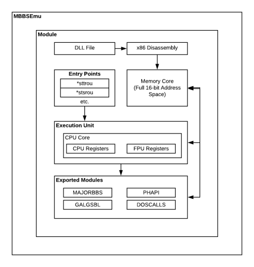

# The MajorBBS Emulation Project

The MajorBBS Emulation Project (**MBBSEmu**) is an Open Source, Cross-Platform emulator for modules written for The MajorBBS and Worldgroup Bulletin Board Systems.
MBBSEmu was created in order to lower the effort required to enjoy the many Games that were written for DOS versions of both The MajorBBS or Worldgroup on any modern operating system or platform including both x86 and ARM.
Thanks to MBBSEmu, casual users who do not want to go through the hassle of setting up a Virtual Machine or configuring a whole Bulletin Board System just to play a game they remember and love can do so easily.

# How It Works

MBBSEmu is very similar to DOSBox, in that it emulates the Galacticomm host environment (MajorBBS/Wordlgroup) as well as the host platform (x86_16).
Modules that were written for The MajorBBS & Worldgroup were different from traditional Bulletin Board System Door games at the time. They were specially written DLL files in NE format which allowed
multiple users to be within a single module at any given time. This is also why Modules written for The MajorBBS & Worldgroup cannot be run on any other Bulletin Board System platform.

MBBSEmu works by loading the Module DLL as the original host software would, and run it within an emulated environment. The actual routines run on an emulated 16-bit x86 Processor with calls into the host
(MAJORBBS.H, PHAPI.H, GALGSBL.H, etc.) being handled by the emulator. Just like the original Galacticomm software, MBBSEmu registers modules and invokes their defined routines when specific events or status
code occur on the user channel.

# Contribute

Because much of this software is several decares old, and the numbers of those who remembers it is quite literally shrinking by the day, it's on us as a community to continue keeping the memory of this software alive and accessible.

You too can help out The MajorBBS Emulation Project in many ways:
* Fix an open [issue](./issues)
* Help write more automated [tests](./tree/master/MBBSEmu.Tests)
* Debug and fix known compatility issues with a Module
* Add some aweome new features we haven't even thought of yet!

# More Information

You can find much more information on MBBSEmu, including documentation as well as Module downloads on the MBBSEmu website: [here](https://www.mbbsemu.com)

# License / Copyright

MBBSEmu is Copyright (c) 2020 Nusbaum Consulting, LLC and is distributed under the MIT License. 